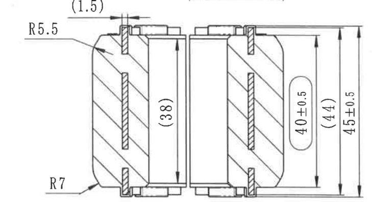

# 20C114709-Y 内容识别

## 视图 1

基于您提供的机械制造图纸，以下是对图中视图含义、尺寸及几何参数的详细解读：

### 尺寸、标注提取

| 提取项 | 原图数值或文本 | 含义解读 |
| :--- | :--- | :--- |
| **顶部小台阶宽度** | `(1.5)` | 位于零件顶部的凸台或密封唇边的宽度为 1.5mm；括号 `()` 表示该尺寸为**参考尺寸**，通常由其他尺寸推导得出，不作为直接加工检验依据。 |
| **左上角圆角半径** | `R5.5` | 零件左侧上部的外轮廓倒角/圆角半径为 5.5mm。 |
| **左下角圆角半径** | `R7` | 零件左侧下部的外轮廓倒角/圆角半径为 7mm。 |
| **内部空腔高度** | `(38)` | 零件内部中空部分（或内骨架）的高度为 38mm；带括号表示为**参考尺寸**。 |
| **核心功能尺寸** | `40±0.5` | 右侧标注在胶囊形框内的尺寸，表示两个半体配合后的关键有效高度或内径为 40mm，公差范围为 ±0.5mm。胶囊框通常强调这是**重要配合尺寸**。 |
| **外部轮廓高度** | `(44)` | 除去上下边缘凸起部分后的主体外部高度为 44mm；带括号表示为**参考尺寸**。 |
| **总高度尺寸** | `45±0.5` | 零件的整体最大垂直高度（包含上下边缘）为 45mm，允许误差范围为 ±0.5mm。 |
| **视图类型** | (图形特征) | 这是一个**剖视图**（剖面线区域表示实体材料被切开），展示了零件的内部结构（如空心、加强筋或嵌件位置）。图形呈左右对称分布，暗示这可能是一个由两半组成的组件（如橡胶衬套、密封圈或轴承保持架）。 |
