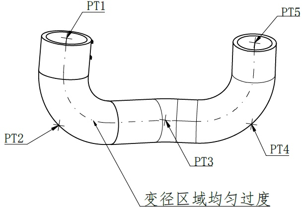

# 20C710332 内容识别

## 视图 1

基于您提供的机械制造图纸视图，以下是对图中内容的解读。

**注意：** 该图纸主要展示的是管路的**拓扑结构、测点位置布局以及形状过渡要求**，图中并未包含具体的数值尺寸（如长度、直径、角度度数等），而是通过字母代号和文字说明来定义设计意图。

### 尺寸、标注及设计说明提取

| 提取项 | 原图数值或文本 | 含义解读 |
| :--- | :--- | :--- |
| **测点/关键位置标识** | `PT1` | **Point 1**：位于左侧直管段顶部的中心或边缘位置，通常代表压力测试点（Pressure Test）或几何测量点。 |
| **测点/关键位置标识** | `PT2` | **Point 2**：位于左侧弯管（U型弯）的外侧圆弧顶点处，用于监测该弯曲部位的参数。 |
| **测点/关键位置标识** | `PT3` | **Point 3**：位于中间水平直管段的中心区域，箭头指向管体内部或中心线，可能代表流量监测或中心截面测量点。 |
| **测点/关键位置标识** | `PT4` | **Point 4**：位于右侧弯管（U型弯）的外侧圆弧顶点处，与 PT2 对称，用于监测右侧弯曲部位。 |
| **测点/关键位置标识** | `PT5` | **Point 5**：位于右侧直管段顶部的中心或边缘位置，与 PT1 对称，代表出口端的测试或测量点。 |
| **中心线/轴线** | `— · — · —` (点划线) | 贯穿整个 U 型管的点划线表示管道的**回转中心线（Axis）**，表明这是一个回转体零件，左右结构理论上关于中心垂直面对称。 |
| **形状公差/设计要求** | `变径区域均匀过度` | **关键制造说明**：指管道从弯曲部分连接到中间直管部分时（或者如果中间管径不同），其截面变化必须是平滑、连续的（Smooth Transition）。 1. **禁止突变**：不能有台阶或尖锐的棱角。 2. **流体/应力性能**：这种设计通常为了减少流体阻力（压降）或避免应力集中导致破裂。 |
| **视图结构** | U型管结构 | 这是一个典型的 U 型弯管（U-bend）或回弯头设计，常见于热交换器、锅炉管道或液压系统中。 |

### 总结
这张图主要是一份**布局图（Layout Drawing）**或**测点分布图**，而非详细的加工尺寸图。它定义了：
1.  **5个关键关注点（PT1-PT5）**的位置分布。
2.  **几何形态**：U型对称结构。
3.  **质量控制要求**：特别强调了连接处的“均匀过渡”，这是保证零件性能（如耐压、耐流）的关键工艺要求。
