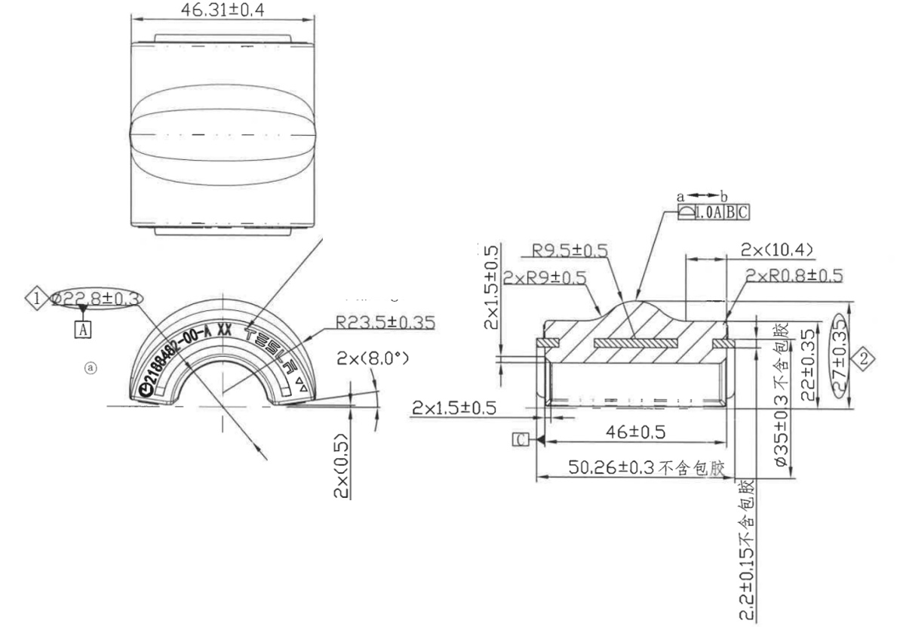

# 20C90483743-Y 内容识别

## 视图 1

根据提供的机械制造图纸，以下是对图中视图、尺寸、角度、弧度及设计参数的详细解读：

### 尺寸、标注提取

| 提取项 | 原图数值或文本 | 含义解读 |
| :--- | :--- | :--- |
| **总长尺寸** | `46.31±0.4` | 零件顶视图（左上）显示的总长度/宽度为 46.31mm，公差范围为 ±0.4mm。 |
| **关键特性/基准直径** | `① Ø22.8±0.3 [A]` | **关键特性(①)**：内孔或配合直径为 22.8mm，公差 ±0.3mm；`[A]` 表示该圆柱面被设定为**基准 A**（通常用于定位或旋转中心）。 |
| **外轮廓半径** | `R23.5±0.35` | 零件主体（半圆环状部分）的外圆弧半径为 23.5mm，公差 ±0.35mm。 |
| **角度尺寸** | `2×(8.0°)` | 两侧边缘的斜度或切角角度为 8.0度，`2×` 表示左右对称各有一处。 |
| **底部厚度/高度** | `2×(0.5)` | 底部凸台或边缘的厚度/高度尺寸为 0.5mm，`2×` 可能指两侧或上下两层结构（结合剖面看可能是底部边缘厚度）。 |
| **零件号/标识** | `C2188482-00-A XX` | 印在零件表面的零件编号或模具号，`XX` 可能代表材质代码或批次号。 |
| **顶部圆弧半径** | `R9.5±0.5` | 剖面图（右侧）中，顶部凸起部分的圆弧半径为 9.5mm，公差 ±0.5mm。 |
| **过渡圆角半径** | `2×R9±0.5` | 顶部凸起与平面连接处的过渡圆角半径为 9mm，公差 ±0.5mm，`2×` 表示左右对称。 |
| **小圆角半径** | `2×R0.8±0.5` | 顶部凸起两侧根部的小圆角半径为 0.8mm，公差 ±0.5mm。 |
| **顶部平台宽度** | `2×(10.4)` | 顶部凸起结构的水平宽度相关尺寸为 10.4mm（可能是半宽或单侧尺寸，需结合对称性理解）。 |
| **侧面台阶高度** | `2×1.5±0.5` | 两侧边缘台阶的高度或厚度为 1.5mm，公差 ±0.5mm。 |
| **形位公差（轮廓度）** | `⌒ 1.0 A B C` (指向 a-b) | **线轮廓度**：表面 a-b 的轮廓度公差为 1.0mm，基准体系为 A、B、C。这意味着该曲线形状必须位于距离理想轮廓 1.0mm 的公差带内。 |
| **内部宽度尺寸** | `46±0.5` | 零件内部或特定台阶处的宽度尺寸为 46mm，公差 ±0.5mm。 |
| **总宽尺寸（不含包胶）** | `50.26±0.3 不含包胶` | 零件的总宽度（可能是外径跨度）为 50.26mm，公差 ±0.3mm。**注意**：此尺寸不包含“包胶”层的厚度，指基材尺寸。 |
| **内孔直径** | `Ø35±0.3 不含包胶` | 内部大孔或安装孔的直径为 35mm，公差 ±0.3mm，同样指明不包含包胶层。 |
| **右侧高度尺寸** | `22±0.35` | 右侧剖视图中，某一层级的高度尺寸为 22mm，公差 ±0.35mm。 |
| **关键特性/总高** | `② 27±0.35` | **关键特性(②)**：零件的总高度或外径相关尺寸为 27mm，公差 ±0.35mm。 |
| **底部间隙/厚度** | `2.2±0.15 不含包胶` | 底部的某个间隙或材料厚度为 2.2mm，公差较严 (±0.15mm)，且不含包胶。 |
| **基准符号** | `[C]` | 左侧面被设定为**基准 C**，用于辅助定位。 |

### 综合设计说明
1.  **零件类型**：这是一个半圆环状或拱形的机械零件，很可能是一个**密封件、衬套或轴承保持架**的半成品（因为多次提到“不含包胶”，暗示后续会有橡胶包覆工艺）。
2.  **视图关系**：
    *   **左上图**：俯视图，展示整体长宽。
    *   **左下图 (a)**：主视图/端面视图，展示半圆形状、角度和表面文字。
    *   **右图**：A-A 或类似位置的剖面图，展示内部层级、厚度、圆角和高度细节。
3.  **关键控制点**：
    *   **尺寸精度**：对直径 `Ø22.8` 和总高 `27` 标记了菱形数字（①、②），说明这是装配时的关键配合尺寸，需重点管控。
    *   **材料状态**：多处标注“不含包胶”，说明图纸定义的是金属或硬塑料骨架的尺寸，最终产品会有软胶层，设计时需预留包胶空间或明确界面。
    *   **形状控制**：通过 `R9.5`、`R23.5` 等半径以及 `1.0 A B C` 的轮廓度公差，严格控制了拱形曲面的形状精度。
