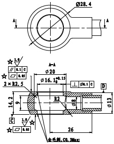

# 20C906904 内容识别

## 视图 1

根据提供的机械制造图纸，以下是对图中视图、尺寸、公差及标注的详细解读：

### 尺寸、标注提取

| 提取项 | 原图数值或文本 | 含义解读 |
| :--- | :--- | :--- |
| **外部最大直径** | `Ø28.4` | 零件左侧法兰盘（凸缘）的外圆直径为 28.4 mm。 |
| **中间台阶直径** | `Ø20` | 中间圆柱段的外径为 20 mm。 |
| **关键配合直径** | `Ø16.1⁺⁰·¹⁵` | 左侧内孔或轴颈直径为 16.1 mm，上偏差 +0.15 mm（下偏差未完全显示，通常为0或负值），属于间隙或过渡配合尺寸。 |
| **右侧轴段直径** | `Ø13` | 最右侧伸出轴段的直径为 13 mm。 |
| **内部小孔直径** | `Ø8` | 右侧中心通孔或盲孔的直径为 8 mm。 |
| **总长度尺寸** | `26` | 零件的总轴向长度为 26 mm。 |
| **左侧台阶长度** | `9` | 左侧大法兰盘部分的轴向厚度/长度为 9 mm。 |
| **局部高度尺寸** | `14.2` | 从底部基准面到左侧台阶顶部的距离（或相关特征高度）为 14.2 mm。 |
| **倒角/圆角半径** | `R2` | 内部台阶过渡处的圆角半径为 2 mm，用于减少应力集中。 |
| **沉孔/凹槽深度** | `2 × R2.5` | 左侧端面有两个对称的凹槽或沉孔，深度或相关尺寸为 2，半径或宽度关联 R2.5（具体需结合剖面看，可能是指两个深2mm的槽）。*注：此处标注略显特殊，也可能指两处R2.5的圆角，但结合“2x”通常指数量。* |
| **形位公差-垂直度** | `⊥ 0.1 C` (框格) | 直径16.1的轴线（或端面）相对于基准C的垂直度公差为 0.1 mm。 |
| **形位公差-同轴度** | `◎ 0.05 A-B` (推测) | 虽然图中右侧框格显示 `| ⊥ | 0.1 | C |`，但通常此类轴类零件会有同轴度要求。图中D处指引线指向右端轴线，可能涉及跳动或位置度。*注：图中清晰可见的是垂直度公差框格。* |
| **表面粗糙度-关键面** | `☆ 1.6 / √` | 带星号 `☆` 的表面（通常是配合面或密封面），表面粗糙度 Ra 值为 1.6 μm，属于较光洁的加工面（如精车或磨削）。 |
| **表面粗糙度-一般面** | `3.2 / √` | 其余加工表面的粗糙度 Ra 值为 3.2 μm（如右上角标注）。 |
| **表面粗糙度-非加工面** | `6.3 / √` (左下角) | 部分非关键配合面的粗糙度要求为 Ra 6.3 μm。 |
| **技术要求/注释** | `去毛刺, C0.3max` | 零件加工完成后需去除锐边毛刺，且倒角最大不超过 C0.3（即 0.3mm × 45°）。 |
| **剖视符号** | `A-A` | 表示该视图是沿 A-A 线切开后的剖视图，用于展示内部孔系结构。 |
| **基准符号** | `A`, `C`, `D` | 图中圆圈内的字母代表几何公差的基准面或基准轴线。例如 A 可能是左端面或中心线，C 可能是某段外圆轴线。 |

### 补充说明
*   **视图类型**：这是一个**全剖视图**（主视图）配合局部外形投影。主视图展示了内部的阶梯孔结构和各段直径关系。
*   **星号 `☆` 含义**：在汽车或精密机械制图中，星号通常标记**关键特性（Key Characteristic）**或**重要特性（Significant Characteristic）**，意味着该尺寸或公差对产品的功能、安全或装配至关重要，生产时需重点控制（如进行SPC统计过程控制）。
*   **公差带**：`Ø16.1` 处的公差标注表明这是一个配合尺寸，精度要求较高。
