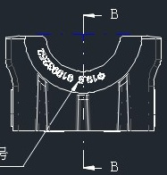
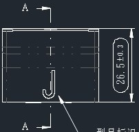
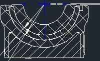
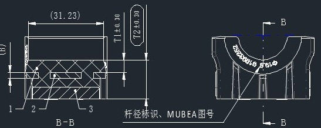
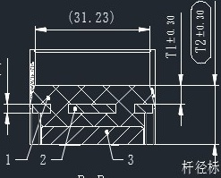

# C114310 内容识别

## 视图 1

根据您提供的机械制造图纸局部截图，这是一个典型的**剖视图（Section View）**，具体为 **B-B 剖视图**。该零件看起来像是一个轴承座、轴瓦盖或类似的弧形支撑结构。

由于图片分辨率限制，部分微小的数字无法精确读取（以 `?` 或近似值表示），但我将针对图中可见的几何特征、标注符号及设计意图进行详细解读。

### 尺寸、标注提取

| 提取项 | 原图数值或文本 | 含义解读 |
| :--- | :--- | :--- |
| **视图名称/剖切标识** | `B` (顶部与底部箭头) | 表示这是 **B-B 剖视图**。箭头指示了剖切面的投射方向（从上往下看或从下往上看，取决于投影法，通常箭头指向保留部分）。 |
| **中心线/对称轴** | `— · — · —` (竖向长划点线) | 表示该零件在左右方向上是**对称结构**。设计和加工时应保证左右对称度。 |
| **内孔圆弧半径** | `R` (后跟模糊数字，如 R30?) | 内部半圆形凹槽的半径尺寸。这是配合轴类零件的关键尺寸，决定了装配间隙。 |
| **均布孔标注** | `6-Ø?` (或类似 `n-Øx`) | **数量-直径**标注法。 1. `6` (推测)：表示沿圆弧方向均匀分布着 6 个孔（可能是油孔、减重孔或安装孔）。 2. `Ø`：表示这些孔是圆形的，后面跟随的是孔的直径数值。 |
| **剖面线 (Hatching)** | 斜线阴影区域 | 表示实体材料被剖切到的截面。斜线方向一致且间距均匀，符合机械制图标准（通常为45°细实线）。 |
| **顶部水平线** | 蓝色高亮线段 | 这通常是 CAD 软件中的**剖切线位置**或**尺寸界线**的显示状态，表示剖切面 B-B 是沿着零件顶部的某个平面或轴线进行的。 |
| **外部轮廓** | 垂直侧壁与底部 | 显示了零件的外部边界。两侧有垂直的加强筋或安装边，底部为平底结构，用于安装在基座上。 |
| **指引线** | 左下角斜线 | 指向底部的引线，通常用于标注材质、热处理要求或未注圆角/倒角说明（图中文字被截断，仅见“号”字，可能是“序号”或“型号”的一部分）。 |

### 设计与工艺说明补充

*   **功能推测**：该零件极可能是一个**滑动轴承座（Split Bearing Housing）**的上半部分或下半部分。内部的半圆槽用于容纳轴瓦或直接支撑旋转轴。
*   **均布孔的作用**：圆弧上的那一排小孔（`6-Ø...`）非常有可能是**润滑油孔**，用于向摩擦面输送润滑脂；或者是为了减轻重量而设计的**减重孔**。
*   **加工注意**：由于存在内部圆弧和均布孔，加工时通常需要用到**数控铣床（CNC）**或**镗床**。剖视图的使用是为了清晰展示内部不可见的轮廓（如内弧和孔的深度）。

## 视图 2

根据您提供的机械制造图纸局部视图，以下是对图中尺寸、标注及几何特征的解读：

### 尺寸、标注提取

| 提取项 | 原图数值或文本 | 含义解读 |
| :--- | :--- | :--- |
| **角度尺寸** | `30` (配合角度符号 `∠`) | 表示该圆弧槽（或U型口）的**开口角度为 30度**。两条蓝色中心线（十字交叉点为圆心）界定了这个扇形区域的角度范围。 |
| **深度/高度尺寸** | `(0.5)` | 右侧标注的竖向尺寸为 **0.5**。括号 `()` 在机械制图中通常表示**参考尺寸**（Reference Dimension），即该数值仅供参考，不作为严格的加工检验标准，或者是由其他尺寸推导出的结果。它表示从顶部平面到圆弧起点的垂直距离（或槽深）。 |
| **表面粗糙度/纹理要求** | `⌷⌷⌷⌷⌷⌷⌷⌷` (波浪线/锯齿状符号) | 位于圆弧内部的白色填充符号。这通常不是标准的Ra粗糙度数值，而是表示**表面纹理方向**或**加工痕迹**的要求。结合其位于弧形槽内，可能意指该表面需要进行特定的打磨、抛光，或者要求纹理沿圆周方向（横向），亦或是表示该处为防滑纹/滚花处理（视具体行业标准而定，但在CAD草图中常用来强调表面状态）。 |
| **几何特征** | U型槽 / 圆弧切口 | 视图展示了一个零件顶部的**半圆形或U型凹槽**结构。蓝色的十字线标示了该圆弧的**圆心位置**，说明该轮廓是基于该中心点绘制的圆弧。 |
| **对称性** | 左右对称结构 | 虽然未直接标注对称符号，但从图形看，该U型槽关于中心垂直线（蓝色竖线）左右对称。 |

**总结说明：**
该视图主要定义了一个**开口角度为 30°** 的顶部圆弧槽。设计者特别标注了 **0.5mm 的参考深度**，并对槽内的**表面状态**（通过波浪符号）提出了特定要求（可能是为了配合、减摩或外观）。

## 视图 3

根据您提供的机械制造图纸局部截图，以下是对图中视图含义、尺寸及标注内容的解读：

### 尺寸、标注提取

| 提取项 | 原图数值或文本 | 含义解读 |
| :--- | :--- | :--- |
| **剖切符号** | `A` (带箭头) | 表示**剖视图的剖切位置与投影方向**。箭头指向右侧，表示从左侧向右侧看（或沿箭头方向投影），用于生成“A-A”剖视图，以展示零件内部结构。 |
| **线性尺寸（高度）** | `26.5±0.3` | 零件右侧边缘的**竖向高度（或宽度）尺寸为 26.5**，允许的加工误差范围为 ±0.3（即合格范围在 26.2 到 26.8 之间）。该尺寸被包含在一个长圆形的边框内，通常表示这是一个参考尺寸或特定区域的标注。 |
| **内部特征（槽/孔）** | `J` 形轮廓 | 视图下方中间位置有一个类似“J”字形的实线轮廓，这代表零件上有一个**J形槽、异形孔或冲压特征**。结合上方的点划线（中心线），该特征可能具有对称性或特定的定位基准。 |
| **中心线** | 点划线 (`- · - · -`) | 图中横向贯穿的点划线表示**对称中心线或轴线**，说明该零件在上下方向可能是对称的，或者该线条是某些孔/槽的定位基准。 |
| **视图类型** | 矩形外框与内部线条 | 这是一个**主视图或俯视图**（取决于投影体系），展示了零件的外部轮廓（矩形板状）以及内部的孔洞分布（上方有一排小圆孔或凹坑的投影）。 |

**补充说明：**
*   **公差分析**：`±0.3` 属于中等精度的公差，通常用于非配合尺寸或一般结构尺寸。
*   **几何特征**：图中的“J”形结构如果是通孔，则在装配中可能用于挂钩或限位；如果是盲槽，则可能用于容纳某种元件。

## 视图 4

根据您提供的机械制造图纸局部截图，以下是对图中可见内容的解读。由于图片裁剪较紧，部分尺寸数值显示不全（如左侧被截断），我将重点解读可见的标注符号、几何特征及右上角的尺寸信息。

### 尺寸、标注提取

| 提取项 | 原图数值或文本 | 含义解读 |
| :--- | :--- | :--- |
| **线性尺寸/公差** | `(0.5)` （右上角） | 表示该处（可能是顶部凸台高度或台阶深度）的基本尺寸为 **0.5**。括号 `()` 通常表示该尺寸为**参考尺寸**（Reference Dimension），即由其他尺寸推导而来，仅供读图参考，不作为加工检验的直接依据；或者表示该公差带/数值的特殊说明。箭头指向顶面与某一基准面的距离。 |
| **中心线/对称轴** | 蓝色点划线（十字交叉） | 表示零件的**回转中心**或**对称中心**。水平线代表轴向中心，垂直线代表径向对称轴。这是车削或磨削类零件的关键基准。 |
| **剖面线（阴影）** | 斜线填充区域 | 表示这是**剖视图**（Section View）。斜线区域代表实体材料被切开的部分，空白区域（如中间的弧形槽）代表空心或凹槽结构。 |
| **几何特征** | 内部弧形凹槽 | 零件内部具有复杂的**曲面轮廓**（可能是球面或大半径圆弧），这通常是轴承座、万向节窝或密封座的结构特征。 |
| **辅助标注线** | 左下侧细实线/点划线 | 指向内部曲面的线条可能是**半径引出线**或**角度标注线**的延伸部分（因图片裁剪，具体数值不可见），用于定义内部弧面的曲率或位置。 |
| **顶部结构** | 顶部矩形凸起 | 零件顶部有一个宽度较窄的凸缘或挡边，其高度或位置由右上角的 `(0.5)` 控制。 |

### 补充说明
*   **视图类型**：这是一个**全剖视图**或**半剖视图**的局部，主要用于展示零件内部的复杂型腔结构。
*   **加工工艺推测**：从内部的圆弧槽和中心线来看，该零件很可能涉及**数控车削**（形成回转体）或**仿形磨削**工艺。
*   **数据缺失提示**：图片左侧和下方的具体半径（R值）和角度值被截断，无法提取具体数值，仅能识别出存在相关的几何定义标注。

## 视图 5

基于您提供的图片，这是一张**机械零件的剖视图（Section View）**。

### 视图含义解读
*   **视图类型**：这是一个**全剖视图**或**局部剖视图**。图中带有斜线阴影（剖面线/Hatching）的区域表示被切开的实体材料部分，空白区域表示孔洞、空腔或非实体部分。
*   **几何特征**：
    *   该零件具有明显的**回转体特征**（如轴承座、轴瓦或碗状容器），因为内部轮廓呈现同心圆弧状。
    *   中心有一条垂直的点划线（Centerline），这是旋转对称轴的标志。
    *   顶部有水平虚线，通常表示内部不可见的轮廓线或配合面。
*   **结构细节**：
    *   零件内部有一个大的半球形或圆柱形凹腔。
    *   左侧有一个倾斜的通道或孔（由两条平行线表示），穿过实体壁。
    *   右侧有阶梯状的结构，可能用于定位或密封。

### ⚠️ 关于尺寸和参数的说明
**重要提示**：您提供的图片是一张**纯几何线条图**，图中**没有任何数字标注、公差符号、角度数值或文字说明**。因此，无法提取具体的“原图数值”。

为了满足您的格式要求，下表列出了图中**存在的几何要素**及其在完整工程图中**应有的含义**（即如果这张图有标注，它们代表什么）：

### 尺寸、标注提取（基于几何特征的推断）

| 提取项 | 原图数值或文本 | 含义解读 |
| :--- | :--- | :--- |
| **中心轴线** | `(垂直点划线)` | 表示该零件是回转体（如圆柱或球体的一部分），所有同心圆弧均以此线为中心。 |
| **内轮廓圆弧** | `(无标注 R值)` | 图中主要的半圆形凹槽。若有标注（如 `R50`），代表内腔的半径大小，决定了配合轴或球的尺寸。 |
| **外轮廓圆弧** | `(无标注 R值)` | 零件外部的弧形边界。若有标注，代表外壳的半径，决定了零件的整体厚度。 |
| **倾斜孔/油道** | `(左侧白色通道)` | 左侧穿过的斜向通道。若有标注（如 `Ø10` 或角度 `45°`），通常代表润滑油路、冷却孔或安装孔的直径及角度。 |
| **顶部虚线** | `(水平虚线)` | 表示在该视角下不可见的内部边缘。通常代表内孔的顶端开口位置，或者是一个沉孔/退刀槽的底部位置。 |
| **剖面线** | `(斜线阴影)` | 遵循制图标准（如 ANSI 或 ISO），表示此处为实心金属被切开的截面。不同零件相邻时剖面线方向应相反。 |
| **右侧台阶** | `(右侧轮廓)` | 右侧的直角转折。若有标注（如宽度 `5`），通常代表密封槽、挡边或装配定位面的尺寸。 |

**总结**：这张图展示了一个**带斜孔的半球形/圆筒形壳体**的结构设计，但缺乏具体的制造数据（尺寸）。如果您需要加工此零件，必须找到带有具体数字标注的原始 CAD 图纸或 PDF 文件。

## 视图 6

根据提供的机械制造图纸，以下是对图中视图、尺寸、标注及说明的详细解读：

### 尺寸、标注提取

| 提取项 | 原图数值或文本 | 含义解读 |
| :--- | :--- | :--- |
| **水平总长尺寸** | `(31.23)` | 零件顶部的水平总宽度为 31.23。括号 `()` 表示该尺寸为**参考尺寸**（Reference Dimension），通常由其他尺寸推导而来，加工时不作为直接检验依据，仅供读图参考。 |
| **左侧高度尺寸** | `T1 ± 0.30` | 零件左侧（或外缘）的垂直高度/厚度为 T1，允许公差为 ±0.30。`T` 可能代表 Thickness（厚度）或特定的高度代号。 |
| **右侧高度尺寸** | `T2 ± 0.30` | 零件右侧（或内缘/台阶处）的垂直高度/厚度为 T2，允许公差为 ±0.30。 |
| **剖切符号** | `B-B` (上下均有) | 表示右侧的视图是沿着左侧视图中 `B-B` 线进行剖切后得到的**剖面图**（Section View）。 |
| **剖面区域** | 交叉斜线填充 | 左图下方的交叉网格线表示该区域为实体材料被剖切到的截面（通常表示金属实体）。 |
| **部件编号** | `1`, `2`, `3` | 左图中的数字引线指向不同的结构层或组件，通常对应 BOM（物料清单）中的序号，表明这可能是一个组合件或具有多层结构的零件。 |
| **弧形阵列孔/特征** | `8xØ3x90°` (推测) | 右图半圆环上的白色小圆圈代表孔或凹坑。虽然文字模糊，但格式通常为 `数量 x 直径 x 角度范围`。例如可能是 8 个直径为 3mm 的孔，分布在 90 度范围内（或者是间距）。*注：因图片清晰度限制，具体数值需核对原图，但结构含义为沿圆弧均布的特征。* |
| **文字说明** | `杆径标识、MUBE A图号` | 这是一条注释，说明图纸上某处（可能是未完全显示的区域或特定标记位）包含“杆径”的识别信息以及供应商“MUBEA”（慕贝尔，知名汽车弹簧/零部件制造商）的图号。 |
| **视图方向** | 箭头 `B` | 指示剖视图 `B-B` 的观察方向。 |

### 综合设计说明
*   **零件类型**：从结构看，这像是一个**板簧端部**、**衬套支架**或某种**弧形连接件**。左图展示了侧面的层叠或台阶结构，右图展示了其弧形的横截面。
*   **关键特性**：尺寸 `T1` 和 `T2` 带有公差 `±0.30`，说明这两个高度/厚度是配合或安装的关键尺寸，需要严格控制。
*   **制造工艺**：右图的弧形结构和孔洞暗示该零件可能涉及**弯曲成型**和**冲孔**工艺。左图的剖面线暗示可能涉及焊接、铆接或复合材料层压结构（如果是多层板簧）。

## 视图 7

### 尺寸、标注提取

| 提取项 | 原图数值或文本 | 含义解读 |
| :--- | :--- | :--- |
| **水平总长尺寸** | `(31.23)` | 零件的总长度（或两外侧特征间距）为 31.23；**括号 `()` 表示该尺寸为参考尺寸**，通常由其他尺寸推导得出，不直接作为加工检验依据。 |
| **厚度/高度尺寸 T1** | `T1 ±0.30` | 指代图纸中特定部位（如上部凸台或壁厚）的厚度为 T1，允许偏差为 ±0.30。`T` 在机械制图中常代表 Thickness（厚度）。 |
| **厚度/高度尺寸 T2** | `T2 ±0.30` | 指代另一特定部位（如右侧台阶或总高）的厚度/高度为 T2，允许偏差为 ±0.30。 |
| **剖面线（阴影）** | 交叉网格线 | 表示该区域为**剖切面**（实体材料被切开的部分）。不同的剖面线方向或间隔可能暗示这是装配图，展示了不同零件（如标号1、2、3所示部件）的啮合或配合关系。 |
| **中心线** | 点划线（长划-短划交替） | 贯穿图形中心的水平线，表示该零件或组件具有**对称性**，或者是回转体/配合件的轴线位置。 |
| **零件序号** | `1`, `2`, `3` | 引出线指向的具体部件编号，用于在明细栏（BOM表）中对应具体的零件名称、材料或规格。 |
| **视图说明** | `杆径标` (右下角文字) | 推测为“杆径标注”或类似说明的缩写，提示该视图重点在于展示杆状零件的直径配合或相关尺寸定义。 |
