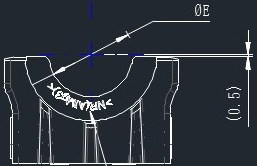
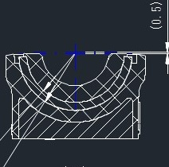

# C114311 内容识别

## 视图 1

基于您提供的机械制造图纸局部截图，以下是对图中可见内容的解读。

**注意**：由于图片分辨率限制且部分尺寸数字模糊（特别是圆弧上的孔位标注），下表主要基于可见的几何特征、符号及工程制图标准进行解读。

### 尺寸、标注提取

| 提取项 | 原图数值或文本 (推测/可见) | 含义解读 |
| :--- | :--- | :--- |
| **剖切符号** | `B` (带箭头) | 表示 **B-B 剖视图** 的剖切位置与投影方向。箭头指向表示从该方向看过去的视图（通常对应全剖或半剖视图）。 |
| **中心线** | 竖向点划线 | 表示零件具有 **回转对称性** 或左右对称，是加工和测量的基准轴线。 |
| **弧形孔组** | 沿圆弧分布的小圆孔 (目测约10-12个) | 这是一个 **圆周阵列孔**（或弧形排孔）。通常用于安装螺栓、销钉或减轻重量。具体数量需查看明细表或放大图。 |
| **孔位尺寸** | 模糊数字 (如 `6x...` 或 `Ø...`) | 位于弧形孔旁的引线标注。通常格式为 `数量 x 直径` (例如 `12xM6` 或 `12xØ6.5`)，表示孔的数量和大小。 |
| **分度圆/节圆** | 穿过小孔中心的细实线/虚线弧 | 表示所有小孔的中心都位于同一个圆弧轨迹上。标注通常会给出这个 **分布圆半径 (PCD/R)** 或直径。 |
| **主轮廓圆弧** | 顶部的大 U 型凹槽 | 零件的主要功能面，可能用于容纳轴、轴承或管道。其半径决定了配合件的大小。 |
| **外部轮廓** | 两侧的垂直壁 | 零件的外部边界，限制了零件的总宽度。 |
| **内部支撑** | 下方的竖直筋板/凸台 | 位于中心线附近的内部结构，可能是为了增加强度（加强筋）或是安装底座的一部分。 |

### 补充说明
*   **视图类型**：这看起来像是一个 **法兰座、轴承盖或管夹** 的正面投影图（或者是剖视后的截面图）。
*   **缺失信息**：由于图片裁剪原因，具体的 **半径值 (R)**、**孔径 (Ø)** 和 **角度范围** 无法精确读取。在实际工程中，需要查看完整的 CAD 图纸或更高清的扫描件来获取这些关键制造参数。

## 视图 2

基于您提供的机械制造图纸局部视图，以下是对图中尺寸、标注及几何特征的解读：

### 尺寸、标注提取

| 提取项 | 原图数值或文本 | 含义解读 |
| :--- | :--- | :--- |
| **角度尺寸** | `30` (带引出线) | 表示内部圆弧槽的**张开角度**（或圆心角）为 30度。引出线指向圆弧的两端边界，说明该凹槽或特征在圆周方向上占据30度的范围。 |
| **线性/深度尺寸** | `(0.5)` | 右侧标注的尺寸，表示从顶部平面到内部圆弧起点的**垂直距离**（或倒角/沉孔深度）为 0.5。括号 `()` 通常表示该尺寸为**参考尺寸**（Reference Dimension），即由其他尺寸推导而来，仅供读图参考，不作为加工检验的直接依据。 |
| **中心线/对称轴** | 蓝色十字交叉线 | 图中的蓝色细实线/点划线表示零件的**几何中心**或**对称轴**。水平线代表顶面基准，垂直线代表左右对称中心。 |
| **轮廓特征** | U型凹槽 | 视图展示了一个零件顶部的截面或投影，中间有一个半圆形的凹槽（U型口），两侧有凸台结构。 |
| **内部细节** | 下方竖线与斜线 | 凹槽底部下方的线条可能表示内部的加强筋、流道或者是剖视图中的剖面线（虽然画得比较简略），暗示该位置内部有结构变化。 |

**总结：**
这张图主要定义了一个零件顶部的**30度开口凹槽**特征，并给出了一个**0.5mm的参考深度**。这通常见于轴承座、滑轮槽或者某种流体接口的局部设计。

## 视图 3

根据您提供的机械制造图纸局部截图，以下是对图中内容的详细解读：

### 尺寸、标注提取

| 提取项 | 原图数值或文本 | 含义解读 |
| :--- | :--- | :--- |
| **竖向总长尺寸** | `26.5±0.3` | 零件右侧标注的竖向总高度（或长度）为 **26.5**，允许的加工误差范围为 **±0.3**（即合格范围在 26.2 到 26.8 之间）。 |
| **剖切符号** | `A` (带箭头) | 上下两侧的 `A` 及箭头表示**剖切位置与投影方向**。这意味着该视图是沿着 A-A 线进行剖切后得到的剖面图（或断面图），用于展示内部结构。 |
| **中心线** | 点划线 (Dash-dot line) | 贯穿图形中心的水平点划线表示该零件在竖直方向上是**对称**的，或者指示了回转体/孔的中心轴线位置。 |
| **J形槽/钩状结构** | 实线轮廓 (底部中间) | 底部中间的“J”形实线轮廓表示一个**开口向上的槽**或**钩状特征**。结合剖视图来看，这通常是一个通槽或特定形状的切口。 |
| **隐藏线/内部结构** | 虚线 (Dashed lines) | 图形内部有两条水平的虚线，表示在该视图中不可见但在内部存在的**棱边或孔的边界**（例如背面的台阶或孔洞）。 |
| **引出说明** | 右下角文字及引线 | 右下角有一条引线指向“J”形槽区域，虽然文字被截断（看似“形位公差”或“技术要求”类文字），但这通常是对该槽的**形状、位置公差**或**表面粗糙度**的具体技术要求说明。 |

### 补充设计参数分析

*   **视图类型**：这是一个**剖视图**（Section View）。通过外部的矩形框和内部的虚实线结合，可以看出这是一个板状或块状零件，中间可能有通孔或空腔（由中心线和虚线暗示）。
*   **对称性**：由于存在水平中心线，设计时通常默认上下结构对称，除非另有标注。
*   **精度要求**：`±0.3` 的公差属于中等精度（未注公差通常为 IT12-IT14 级左右，具体取决于基本尺寸），表明该长度尺寸不是极高精度的配合尺寸，但需要控制在一定范围内以保证装配。

## 视图 4

根据您提供的机械制造图纸局部截图，以下是对图中可见内容的解读。由于图片裁剪较多，部分完整尺寸不可见，以下主要基于可见的标注和几何特征进行分析：

### 尺寸、标注提取

| 提取项 | 原图数值或文本 | 含义解读 |
| :--- | :--- | :--- |
| **线性尺寸/公差** | `(0.5)` | 位于右上角，箭头指向顶部边缘与某基准线（可能是中心线或理论轮廓）的距离。**括号 `()` 通常表示该尺寸为参考尺寸（Reference Dimension）**，即仅供读取参考，不作为直接加工或检验的依据，或者是由其他尺寸推导出的结果。数值为 0.5。 |
| **几何中心/对称轴** | 蓝色十字线 | 表示该零件（轴承座或轴瓦类零件）的**回转中心**或**对称中心**。水平点划线为水平中心线，垂直点划线为垂直中心线。 |
| **剖面符号** | 斜线阴影（45°） | 表示这是**剖视图**（Section View）。斜线区域代表被切到的实体材料（金属），空白区域代表孔洞或空腔。 |
| **配合面/接触面** | 内部双层弧线 | 中间带有网格状/交叉阴影的区域通常表示**轴瓦（Bearing Shell）**或**衬套**。这表明该零件是一个轴承座，内部安装有一个可更换的滑动轴承衬套。 |
| **润滑结构** | 左下方的斜向通道 | 左侧有一条贯穿壁厚的斜向细长孔道，这通常是**油孔（Oil Hole）**或**油槽**，用于向轴承摩擦面输送润滑油。 |
| **定位/安装特征** | 顶部两侧的凹槽 | 顶部左右两侧各有一个矩形的凹槽结构，这通常是**止动槽**或**定位唇**，用于防止内部的轴瓦在旋转时发生转动，或者用于固定外部部件。 |
| **辅助线/构造线** | 放射状细实线 | 从中心向外辐射的线条，以及连接不同圆弧的切线，属于绘图时的**构造线**，用于确定圆弧的圆心、切点或角度范围。 |

### 总结说明
*   **零件类型推测**：这是一个典型的**剖分式轴承座（Split Bearing Housing）**或**轴瓦盖**的半剖视图。
*   **关键设计意图**：设计重点在于保证内孔（安装轴瓦处）的圆度以及与轴瓦的配合精度。顶部的 `(0.5)` 可能是在控制盖体结合面相对于理论中心的微小偏差，或者是油槽的深度/宽度参考。
*   **缺失信息**：由于图片不完整，无法看到具体的直径（如内径 ID、外径 OD）、总宽度、螺栓孔位置等关键定形和定位尺寸。

## 视图 5

基于您提供的机械制造图纸局部视图，这是一个典型的**剖视图（Section View）**，展示了一个带有弧形槽或轴承座结构的零件内部细节。

由于原图中**未包含具体的数字尺寸标注**（如具体的毫米数值），下表将重点解读图中的**几何特征、符号含义、线条类型及设计意图**。

### 尺寸、标注与几何特征提取

| 提取项 | 原图视觉元素/符号 | 含义解读 |
|---|---|---|
| **剖面线（Hatching）** | 实体区域填充的细斜线（约45°） | 表示该区域为**实心材料被切开的截面**。斜线方向一致且间距均匀，表明这是同一个零件的连续实体部分。 |
| **中心线（Center Line）** | 蓝色的点划线（长划-短划-长划） | **对称轴或回转中心**。垂直的中心线表明该零件（或该局部结构）关于此线左右对称；水平的中心线可能标示了圆弧槽的理论中心高度。 |
| **弧形轮廓（Arcs）** | 多组同心或平行的白色曲线 | 代表**圆柱面或球面的内/外表面**。这通常是一个轴承座、轴瓦或流体通道的内壁，具有特定的半径（R值，虽未标出但由圆心决定）。 |
| **引出标注线（Leader Line）** | 左侧指向弧形表面的带箭头细实线 | 用于指示特定的几何要素。虽然图中文字被截断，但在机械制图中，这通常用于标注**表面粗糙度（如 Ra 1.6）、形位公差（如圆度、圆柱度）或材质热处理要求**。 |
| **顶部水平蓝线** | 顶部的蓝色实线/虚线组合 | 可能是**尺寸界线**或**辅助作图线**。如果是虚线部分，可能表示内部不可见的棱边或配合件的边界。 |
| **网格状线条（Cross-hatching on curve）** | 弧形区域内的交叉网格线 | 在标准机械制图中，这通常表示**滚动体（如滚珠、滚柱）**或者是一种特殊的**非金属/复合材料填充**。如果是轴承装配图，这极大概率代表保持架内的滚珠排列。 |
| **右侧矩形凹槽** | 右上角的“L”型或矩形缺口 | 这是一个**退刀槽、密封槽或定位台阶**。用于安装密封圈（O-ring）或限制轴向位置。 |

### 设计与制造说明补充

*   **视图类型**：这是一个**全剖视图**或**半剖视图**的局部。设计师通过假想切开零件，来展示内部的空腔结构和壁厚。
*   **对称性设计**：垂直中心线的存在意味着加工时只需标注一侧的尺寸（如半径 R），另一侧默认为对称，这简化了图纸标注。
*   **配合关系**：图中的弧形面显然是为了与另一个圆柱形零件（如轴或轴承外圈）进行**间隙配合或过渡配合**。
*   **缺失信息提示**：要完全解读此图进行加工，还需要知道以下缺失参数（通常在完整图纸的其他位置）：
    *   主圆弧的半径 $R$ 及公差。
    *   零件的总宽度或深度。
    *   引出线所指的具体粗糙度数值。
    *   材料的硬度要求（因为涉及摩擦副）。

## 视图 6

根据您提供的机械制造图纸，以下是对图中视图、尺寸、标注及说明的详细解读：

### 尺寸、标注提取

| 提取项 | 原图数值或文本 | 含义解读 |
| :--- | :--- | :--- |
| **水平总长尺寸** | `(31.23)` | 零件的总长度（或关键水平跨度）为 31.23。括号 `()` 表示该尺寸为**参考尺寸**，通常由其他尺寸推导而来，不作为直接加工检验的唯一依据。 |
| **竖向高度尺寸 1** | `T1 ± 0.30` | 左侧台阶或特定部位的高度/厚度为变量 T1，允许公差范围为 ±0.30。 |
| **竖向高度尺寸 2** | `T2 ± 0.30` | 右侧台阶或特定部位的高度/厚度为变量 T2，允许公差范围为 ±0.30。（T1/T2 可能代表不同配置下的厚度变量）。 |
| **剖面标识** | `B-B` (左图下方)   `B` (右图上下) | 表示视图对应关系。右图为 **B-B 剖视图**，即沿着左图中标注的 B-B 剖切线切开后看到的截面形状。 |
| **部件序号** | `1`, `2`, `3` (左图引线) | 装配图中的零件序号。1、2、3 分别指向不同的组件或层级（如外壳、内部填充物/弹簧片、底座等）。 |
| **剖面线（阴影）** | 交叉网格线 / 斜线 | 左图中不同方向的剖面线代表不同的材料或零件。例如，标号 2 处的交叉网格可能表示复合材料、橡胶或特定的填充结构；标号 3 处的单向斜线表示金属实体。 |
| **圆弧轮廓与阵列孔** | `6xØ4xM1.5 Ø1.5` (右图弧形文字) | **关键特征**： 1. 沿圆弧分布有 **6个** (`6x`) 孔/特征。 2. `Ø4` 可能指沉头孔直径或特定特征外径为 4。 3. `M1.5` 表示螺纹规格为公制 1.5mm（或者是某种特定代号，但在机械图中 M 通常指螺纹）。 4. `Ø1.5` 可能指底孔直径或内径为 1.5。 *(注：此处标注较为紧凑，也可能解读为：6个直径为4的孔，内含M1.5螺纹，或者涉及两种不同直径的特征)* |
| **中心线/对称轴** | 点划线 (右图中间) | 表示该零件在几何形状上是左右对称的。 |
| **文字说明** | `杆径标识、MUBEA图号` | **技术要求/注释**： 1. 此处需要打标“杆径”相关的识别码。 2. `MUBEA` 是著名的汽车悬架弹簧制造商（慕贝尔），说明这是该品牌的零件，需遵循其图号标准。 |
| **局部细节** | 右图顶部的蓝色短线 | 可能是CAD软件中的捕捉点、测量辅助线，或者是表示某个配合面的接触区域。 |

### 总结
这张图纸展示了一个**MUBEA品牌的复合或多层结构零件**（可能是汽车悬架系统中的衬套或弹簧组件）。
*   **左图**展示了侧视的装配结构，包含三个主要部分（1, 2, 3），并标注了总长和分段高度公差。
*   **右图**是 B-B 截面图，展示了零件呈 U 型或弧形的截面特征，重点在于弧形面上分布的 **6组微小孔/螺纹特征**（Ø4/M1.5/Ø1.5），这通常用于安装、定位或减重。

## 视图 7

根据您提供的机械制造图纸局部视图，以下是对图中尺寸、标注及符号的解读：

### 尺寸、标注提取

| 提取项 | 原图数值或文本 | 含义解读 |
| :--- | :--- | :--- |
| **水平参考尺寸** | `(31.23)` | 顶部水平方向的总宽度/跨度为 31.23。**括号 `()` 表示该尺寸为参考尺寸**（Reference Dimension），通常由其他尺寸推导而来，加工时不作为直接检验依据，仅供参考。 |
| **厚度尺寸 T1** | `T1±0.30` | 右侧上方标注的 `T1` 代表第一处厚度（通常指上部板材或壁厚的名义尺寸），公差范围为 ±0.30。 |
| **厚度尺寸 T2** | `T2±0.30` (圆角矩形框内) | 右侧下方标注的 `T2` 代表第二处厚度。**圆角矩形框（胶囊形）**通常用于强调关键尺寸或区分不同类别的厚度参数，公差同为 ±0.30。 |
| **剖面线（斜线填充）** | 图例 1、2、3 区域 | 区域内的交叉斜线（剖面线）表示该物体被剖切后的实体材料部分。不同的编号（1, 2, 3）可能代表不同的零件组件或装配关系。 |
| **中心线/对称轴** | 贯穿中部的点划线 | 水平的长划-短划交替线条表示该零件在垂直方向上是**对称**的，或者指示了孔/槽的中心位置。 |
| **引出标注** | `1`、`2`、`3` | 数字配合引线指向具体的结构层或零件，通常对应图纸下方的明细表（BOM）或技术要求说明（例如：1-外壳，2-衬垫，3-基座等）。 |
| **视图名称/投影方向** | `F - F` (底部截断文字) | 底部的文字暗示这是一个名为 "F-F" 的剖视图（Section View F-F），表示这是沿着图纸其他位置标示的 F-F 剖切线切开后看到的内部结构。 |
| **右下角文字** | `杆径标...` | 可能是“杆径标准”或类似的技术说明标题的一部分，提示该视图可能与杆类零件的直径标准有关。 |

**总结：**
这是一个**剖视图（Section View）**的局部，主要展示了一个多层结构的组件（可能是密封件、复合板或装配体）。设计重点在于控制总宽（参考值 31.23）以及两个关键厚度尺寸（T1 和 T2）的精度（±0.30）。
