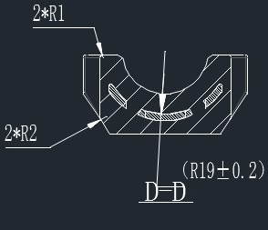
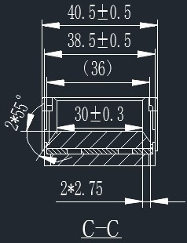
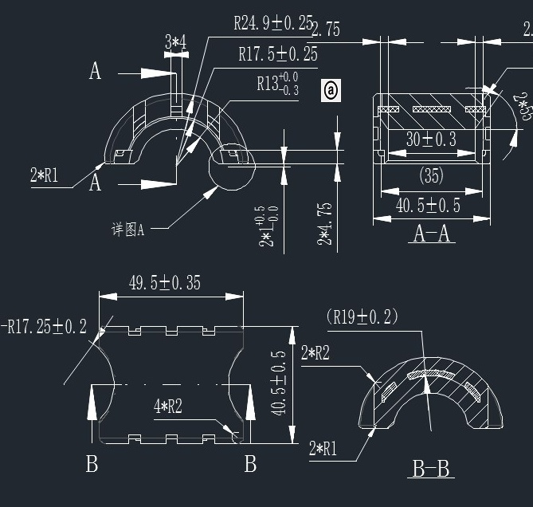
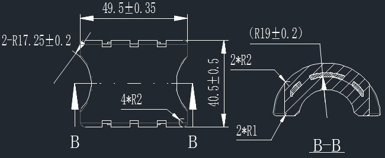
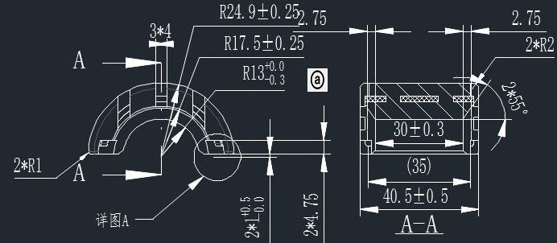
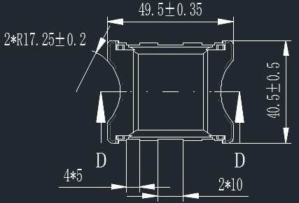
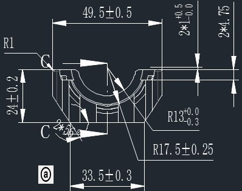

# C114319 内容识别

## 视图 1

### 尺寸、标注提取

| 提取项 | 原图数值或文本 | 含义解读 |
| :--- | :--- | :--- |
| **视图名称/剖切标识** | `D-D` | 表示该图为 **D-D 剖视图**。即假想沿图纸中垂直的中心线（剖切线 D-D）将零件切开，移去观察者与剖切面之间的部分，对剩余部分向投影面所做的正投影。图中剖面线（斜线阴影）表示被切到的实体材料区域。 |
| **顶部圆角半径** | `2*R1` | 指零件顶部左右两个外侧棱边的倒圆角半径为 **R1**。`2*` 表示共有两处相同的该特征（左侧和右侧各一个）。具体数值需参照图纸其他处的 R1 定义。 |
| **底部过渡圆角半径** | `2*R2` | 指零件内部凹槽底部与侧壁连接处的过渡圆角半径为 **R2**。`2*` 表示左右对称共有两处。具体数值需参照图纸其他处的 R2 定义。 |
| **中心主圆弧半径及公差** | `(R19±0.2)` | 指零件中心大凹槽（U型口）的轮廓圆弧半径为 **19**。括号 `()` 通常表示该尺寸为 **参考尺寸**（由其他尺寸推导而来，仅供读图参考，不作为直接加工检验依据，或者此处仅作为强调）。`±0.2` 为该半径的尺寸公差，允许加工误差范围为 18.8 至 19.2。 |
| **对称中心线** | （垂直点划线） | 贯穿视图中心的垂直细点划线，表示该零件在几何形状上关于此线 **左右对称**。 |

## 视图 2

### 尺寸、标注提取

| 提取项 | 原图数值或文本 | 含义解读 |
| :--- | :--- | :--- |
| **视图名称** | `C-C` | 表示这是剖视图（Section View），剖切位置由图纸其他地方的 C-C 剖切线定义。剖面线（斜线阴影）表示该区域为实体材料被切开的截面。 |
| **外部总宽尺寸** | `40.5±0.5` | 零件最外侧（顶部凸台或整体）的宽度尺寸为 40.5，允许偏差范围为 ±0.5（即 40.0 ~ 41.0）。 |
| **主体/台阶宽度尺寸** | `38.5±0.5` | 下方主体部分或第二级台阶的宽度尺寸为 38.5，公差为 ±0.5。 |
| **参考尺寸** | `(36)` | 括号内的数字表示**参考尺寸**（Reference Dimension）。通常是由其他尺寸推导而来，或者仅供加工/检验时参考，不作为严格的验收标准。此处指内部某特征的宽度约为 36。 |
| **内部槽/孔宽度尺寸** | `30±0.3` | 内部凹槽或通孔的宽度尺寸为 30，公差较严，为 ±0.3。这是配合或功能关键尺寸。 |
| **倒角/角度尺寸** | `2x45°` | 左下角的倒角标注。表示有 **2处**（或长度为2mm）的 **45度** 倒角。结合引线指向，通常指左上和左下两个角落的倒角规格为 C2（即直角边长为2mm，角度45°）。 |
| **壁厚/间距尺寸** | `2*2.75` | 底部标注，表示有两个位置的尺寸值为 2.75。结合图形看，这很可能是指内部空腔两侧的**壁厚**，或者是两个小孔/槽的中心距边缘的距离，单侧厚度为 2.75。 |

## 视图 3

根据提供的机械制造图纸，以下是对图中视图、尺寸、公差及设计参数的详细解读：

### 尺寸、标注提取

| 提取项 | 原图数值或文本 | 含义解读 |
| :--- | :--- | :--- |
| **外轮廓圆弧半径** | `R24.9±0.25` | 零件最外侧半圆拱形的半径为 24.9mm，允许误差范围为 ±0.25mm。 |
| **内轮廓圆弧半径** | `R17.5±0.25` | 零件内侧拱形结构的半径为 17.5mm，公差 ±0.25mm。 |
| **中心孔/槽半径** | `R13 +0.0/-0.3` | 内部核心圆弧或孔的半径为 13mm；公差为单向负公差（0到-0.3），表示该尺寸只能偏小不能偏大，通常为了保证配合间隙或强度。 |
| **位置度公差** | `` (带圈M) | 位于 R13 尺寸旁，表示最大实体要求（Maximum Material Condition）。意味着当特征处于最大实体状态时，必须满足给定的几何公差；若偏离最大实体状态，可获得额外的补偿公差。 |
| **局部放大详图索引** | `A` / `详图A` | 指示左上角区域为局部放大视图“详图A”，用于清晰展示细小结构（如卡扣或齿槽）。 |
| **详图A处宽度尺寸** | `3*4` | 在详图A区域内，有3处宽度为4mm的结构（可能是齿宽或槽宽）。 |
| **左侧小圆角** | `2*R1` | 左侧边缘有两个半径为 1mm 的圆角过渡。 |
| **竖向高度尺寸1** | `2*4.75` | 表示有两处高度为 4.75mm 的特征（可能是台阶高度或特定层级厚度）。 |
| **竖向高度尺寸2** | `2* +0.5/0.0` | 某处高度尺寸为 2mm，公差为单向正公差（+0.5/0），即允许范围在 2.0mm 至 2.5mm 之间。 |
| **剖视图 A-A 总宽** | `40.5±0.5` | 零件在 A-A 剖面处的总宽度（跨度）为 40.5mm，公差 ±0.5mm。 |
| **剖视图 A-A 内宽** | `(35)` | 参考尺寸（括号表示），内部净宽或辅助定位宽度约为 35mm，不作为严格检验标准。 |
| **剖视图 A-A 槽宽** | `30±0.3` | 剖面中主要凹槽或安装位的宽度为 30mm，公差 ±0.3mm。 |
| **剖视图 A-A 侧壁圆角** | `2*R3` | 剖面图右侧内壁有两个半径为 3mm 的圆角。 |
| **主视图总长** | `49.5±0.35` | 零件整体的水平长度（不含突出部或含特定边界）为 49.5mm，公差 ±0.35mm。 |
| **主视图总高** | `40.5±0.5` | 零件整体的垂直高度为 40.5mm，公差 ±0.5mm。 |
| **主视图左侧大圆角** | `-R17.25±0.2` | 左侧端部的圆弧半径为 17.25mm，精度要求较高（±0.2mm）。注：前面的短横线可能指代特定基准或方向。 |
| **底部圆角** | `4*R2` | 零件底部边缘有4处半径为 2mm 的圆角（可能是为了去毛刺或装配导向）。 |
| **剖视图 B-B 索引** | `B-B` | 右下角的视图为沿 B-B 线切割的剖面图，展示了零件侧面的拱形结构。 |
| **B-B 视图理论半径** | `(R19±0.2)` | 侧面拱形的理论半径为 19mm，公差 ±0.2mm。括号可能表示这是由其他尺寸推导出的参考值，或者是成型模具的理论值。 |
| **B-B 视图圆角** | `2*R2` / `2*R1` | 侧面视图中，顶部有两个 R2 圆角，底部有两个 R1 圆角。 |

### 视图与设计说明总结

1.  **视图构成**：
    *   **左上主视图**：展示了零件的正面轮廓，是一个类似“桥洞”或半圆拱形的结构，带有复杂的内部凹槽和外部轮廓。
    *   **右上剖视图 (A-A)**：展示了零件横向切开后的内部结构，可以看出内部是空心的或者有特定的安装槽（宽30mm），且两侧有壁厚。
    *   **左下俯/仰视图**：展示了零件的平面布局，标出了总长49.5mm和总高40.5mm，以及底部的4个R2圆角细节。
    *   **右下剖视图 (B-B)**：展示了零件纵向（或侧面）切开的形状，确认了其拱形截面的曲率（R19）。

2.  **关键设计特征**：
    *   **精密配合**：图中多处使用了较严的公差（如 ±0.2, ±0.25），特别是圆弧半径部分，说明该零件可能涉及旋转配合或精密密封。
    *   **最大实体要求 (Ⓜ)**：R13处的符号表明设计者关注的是零件的“功能性边界”，即在保证装配的前提下，允许形状公差随尺寸变化而放宽，这是一种优化制造成本的设计手段。
    *   **去应力/防干涉**：大量的圆角标注（R1, R2, R3）表明设计注重消除应力集中，防止裂纹产生，同时也便于脱模（如果是注塑件）或装配时的导入。

## 视图 4

根据您提供的机械制造图纸，以下是对图中视图、尺寸、公差及几何特征的详细解读：

### 尺寸、标注提取

| 提取项 | 原图数值或文本 | 含义解读 |
| :--- | :--- | :--- |
| **总长尺寸** | `49.5±0.35` | 零件主体的总长度（水平方向）为 49.5 mm，允许误差范围为 ±0.35 mm。 |
| **总宽/高度尺寸** | `40.5±0.5` | 零件主体的总宽度（垂直方向，即两圆弧顶点间距）为 40.5 mm，允许误差范围为 ±0.5 mm。 |
| **侧边大圆弧半径** | `2-R17.25±0.2` | 左右两侧的外轮廓为大圆弧，半径为 17.25 mm，公差 ±0.2 mm；`2-` 表示左右对称共有两处。 |
| **顶部外圆弧半径** | `(R19±0.2)` | 右侧剖视图中显示的顶部外轮廓圆弧半径为 19 mm，公差 ±0.2 mm。括号 `()` 通常表示参考尺寸或成型尺寸。 |
| **内部槽圆角半径** | `4*R2` | 中间长方形镂空区域（或加强筋槽）的四个内角均为圆角，半径为 2 mm；`4*` 表示共有4处。 |
| **剖面过渡圆角** | `2*R2` | 在 B-B 剖视图中，指代剖面轮廓上的两处圆角（可能是顶部边缘或台阶处），半径为 2 mm。 |
| **底部小圆角** | `2*R1` | 在 B-B 剖视图中，指代底部边缘的两处小圆角，半径为 1 mm。 |
| **剖切符号** | `B` / `B-B` | 主视图下方的 `B` 和箭头表示剖切位置及投影方向；右侧图形为沿 B-B 线切开后的断面图（剖面图），展示了零件的拱形截面结构。 |
| **截面特征** | (剖面线区域) | 右侧 B-B 视图中的斜线阴影表示实体材料部分，显示该零件是一个类似“拱桥”或“卡扣”的中空/半圆结构，且顶部有矩形凹槽（对应主视图中间的缺口）。 |

### 综合设计说明
*   **零件形态**：这是一个具有拱形截面的连接件或卡扣件。主视图展示了其平面布局，呈哑铃状或工字型变体，两端圆润，中间有开槽。
*   **对称性**：从标注 `2-R...` 和图形形状来看，该零件在水平和垂直方向上均具有高度对称性。
*   **精度要求**：
    *   长度方向精度较高（±0.35）。
    *   侧边圆弧半径精度最高（±0.2），这通常是配合面，决定了零件能否顺利装入或卡紧。
    *   宽度方向精度相对宽松（±0.5）。

## 视图 5

根据提供的机械制造图纸，以下是对图中视图、尺寸、角度、弧度及设计参数的详细解读：

### 尺寸、标注提取

| 提取项 | 原图数值或文本 | 含义解读 |
| :--- | :--- | :--- |
| **剖视符号** | `A` / `A-A` | 表示左侧视图为剖切位置，右侧视图为沿 A-A 线切开后的剖面图（Section A-A），用于展示内部结构。 |
| **局部放大图索引** | `详图A` (带圆圈箭头) | 指示左侧半圆环上的某个细节（可能是圆孔或倒角）有放大的局部视图（虽然图中未完全展示放大图本身，但标出了索引位置）。 |
| **外圆弧半径** | `R24.9±0.25` | 零件最外侧轮廓的圆弧半径为 24.9mm，允许误差范围为 ±0.25mm。 |
| **中圆弧半径** | `R17.5±0.25` | 中间层结构的圆弧半径为 17.5mm，公差 ±0.25mm。 |
| **内圆弧半径** | `R13 +0.0/-0.3` | 最内侧孔/槽的圆弧半径基本尺寸为 13mm；公差为单向公差，上限偏差 0，下限偏差 -0.3（即尺寸范围 12.7~13.0mm）。 |
| **关键特性标识** | `ⓐ` (圆圈a) | 位于 R13 尺寸旁，通常表示该尺寸为**关键特性**（Key Characteristic）或重要配合尺寸，需重点控制。 |
| **顶部凸台宽度** | `3*4` | 顶部矩形凸台（或键槽结构）的宽度为 3mm，高度（或长度）为 4mm。 |
| **底部圆孔直径** | `2*Ø4 +0.5/0` | 底部两侧各有一个圆孔（共2个），直径基本尺寸为 4mm；公差为 +0.5/0（即孔径范围 4.0~4.5mm），属于间隙配合或安装孔。 |
| **总高度尺寸** | `2*4.75` | 从中心水平线到顶部或底部的垂直距离相关尺寸，或者是两个对称部分的总高度参数（具体依基准而定，此处指代竖向跨度）。 |
| **剖面总宽度** | `40.5±0.5` | 右侧剖面图显示的零件总轴向长度（厚度方向）为 40.5mm，公差 ±0.5mm。 |
| **参考尺寸** | `(35)` | 括号内的数字表示**参考尺寸**（Reference Dimension），仅供读图参考，不作为加工检验的直接依据，通常由其他尺寸推导而来。 |
| **内部槽宽** | `30±0.3` | 剖面图中内部凹槽或空腔的宽度为 30mm，公差 ±0.3mm。 |
| **端部倒角/圆角** | `2*R2` | 零件两端（轴向端面）的圆角半径为 2mm，共两处。 |
| **角度标注** | `2x30°` | 表示有两处 30 度的角度特征（可能是倒角角度或斜面角度）。 |
| **边缘圆角** | `2*R1` | 左下角或其他边缘处的圆角半径为 1mm，共两处。 |
| **顶部小台阶尺寸** | `2.75` (出现两次) | 顶部两侧的小台阶或凸缘的宽度/高度尺寸为 2.75mm。 |

### 总结说明
该图纸描述了一个**半圆环形的机械零件**（可能是轴承座、衬套或支架的一部分）。
*   **几何特征**：主体呈半圆形，具有多层同心圆弧结构（R24.9, R17.5, R13）。
*   **连接特征**：底部有两个直径为 4mm 的安装孔；顶部有一个宽 3mm 的凸台结构。
*   **内部结构**：通过 A-A 剖视图可以看出，零件内部是空心的或有特定的槽结构（宽 30mm），且两端有 R2 的圆角过渡。
*   **精度要求**：内弧 R13 和顶部/中部圆弧 R17.5/R24.9 的公差较严（±0.25 或 0/-0.3），表明这些面可能是配合面。

## 视图 6

根据提供的机械制造图纸视图，以下是对图中尺寸、标注及几何特征的详细解读：

### 尺寸、标注提取

| 提取项 | 原图数值或文本 | 含义解读 |
| :--- | :--- | :--- |
| **顶部总宽尺寸** | `49.5±0.35` | 零件顶部的最大水平宽度（包含两侧凸耳/安装脚）为 49.5mm，允许偏差范围为 ±0.35mm。 |
| **主体高度尺寸** | `40.5±0.5` | 零件主体（不含底部引脚）的垂直高度为 40.5mm，公差为 ±0.5mm。该尺寸定义了从顶部平面到主体底部（引脚根部）的距离。 |
| **侧边圆弧半径** | `2*R17.25±0.2` | 零件左右两侧的大圆弧轮廓半径为 17.25mm，公差 ±0.2mm。`2*` 表示左右对称共有两处相同的圆弧特征。 |
| **底部引脚间距 (外侧)** | `4*5` (配合引线) | 底部四个引脚（或安装腿）中，相邻引脚的中心距或边缘间距为 5mm。`4*` 暗示底部共有4个此类间隔（对应4个引脚形成的3个内部间隔+外部参考，或者指代4个引脚本身的某种宽度/间距属性，结合图形看更像是引脚间的净空或步距）。*注：此处标注略显简略，通常指引脚中心距或间隙。* |
| **底部引脚间距 (内侧)** | `2*10` | 中间两个引脚（或两组引脚）之间的跨度/距离为 10mm。`2*` 可能表示对称性或数量，但在间距标注中通常指该特定跨度的数值。结合图形，这应该是内侧两个引脚中心的距离。 |
| **剖面/区域标识** | `D` | 图中的 `D` 字母通常作为剖面索引符号（如 D-D 剖面）或区域引用标记，指示该位置有对应的详图或剖视图说明。 |
| **几何对称性** | 图形整体布局 | 零件呈现明显的左右对称结构，中心有一条点划线（中心线），表明所有未单独标注的对称特征均关于此轴对称。 |
| **底部结构特征** | 矩形凸起 | 底部有两个向下延伸的矩形结构（引脚或安装柱），其宽度未直接标注，但通过 `4*5` 和 `2*10` 限定了它们的位置关系。 |

### 补充说明
*   **公差分析**：该零件的尺寸精度要求中等。宽度公差 (±0.35) 比高度公差 (±0.5) 和圆弧公差 (±0.2) 略严，说明水平方向的配合或安装位置可能更为关键。
*   **视图类型**：这是一个正视图（Front View），展示了零件的外部轮廓和主要安装尺寸。
*   **应用场景推测**：从形状看，这很像是一个电子元件的外壳（如继电器、变压器骨架）或某种机械卡扣座，两侧的圆弧可能是为了适配圆形外壳或提供握持/安装空间，底部的引脚用于插入PCB板或固定底座。

## 视图 7

根据您提供的机械制造图纸视图，以下是对图中尺寸、标注及几何特征的详细解读：

### 尺寸、标注提取

| 提取项 | 原图数值或文本 | 含义解读 |
|---|---|---|
| **顶部水平总宽** | `49.5±0.5` | 零件顶部的总宽度尺寸为 49.5，允许偏差范围为 ±0.5（即 49.0 ~ 50.0）。 |
| **右侧台阶高度 (上)** | `2 +0.5 / 0.0` | 右上角凸台/台阶的高度为 2，公差为单向正公差 +0.5/0（即 2.0 ~ 2.5）。 |
| **右侧台阶高度 (下)** | `2*4.75` | 表示有两处（或两层）高度为 4.75 的尺寸结构，通常指右侧下方的两个台阶或孔深相关尺寸。 |
| **左侧台阶高度** | `21±0.2` | 左侧主体部分的高度/厚度为 21，公差为 ±0.2（即 20.8 ~ 21.2）。 |
| **左上角圆角** | `R1` | 左上角外轮廓的倒圆角半径为 1。 |
| **左下角圆角** | `C 2*26°` (推测) | 此处标注较为特殊，结合引线指向左下角过渡区，`C` 通常代表倒角(Chamfer)，但后跟角度 `26°` 可能表示该处为一个特定角度的斜面或圆弧过渡起点；或者表示两处(C2)且角度相关。需结合3D模型确认，大概率为左下侧的倒角或过渡特征。 |
| **底部水平定位尺寸** | `33.5±0.3` | 底部某关键特征（如底槽宽度或两底脚内侧距离）的尺寸为 33.5，公差 ±0.3。 |
| **底部基准标识** | `ⓐ` (方框a) | 这是一个基准目标或基准特征符号，表示该尺寸（33.5）或其所在的表面/轴线被定义为基准 A，用于后续形位公差的参考。 |
| **内部大圆弧半径** | `R17.5±0.25` | 零件中间主要凹槽/内腔的大圆弧半径为 17.5，精度较高，公差为 ±0.25。 |
| **内部小圆弧半径** | `R13 +0.0 / -0.3` | 内部某一较小圆弧（可能是槽底或过渡圆角）半径为 13，公差为单向负公差 0/-0.3（即 12.7 ~ 13.0），这通常是为了保证配合时的最小间隙或最大过盈。 |

### 综合设计说明
1.  **对称性**：从图形形态看，该零件左右大致对称，但尺寸标注主要集中在单侧或总体，暗示了对称设计的意图。
2.  **精度要求**：
    *   `R13` 和 `R17.5` 的圆弧尺寸公差较严（特别是 R13 的负公差），说明这两个圆弧面可能是重要的配合面或功能面（如轴承座、滑轮槽等）。
    *   线性尺寸公差多在 ±0.2 ~ ±0.5 之间，属于中等精度的机械加工件。
3.  **结构特征**：这是一个典型的“U”型或马鞍型支架类零件，具有较大的内凹圆弧，两侧有安装耳或支撑壁。
